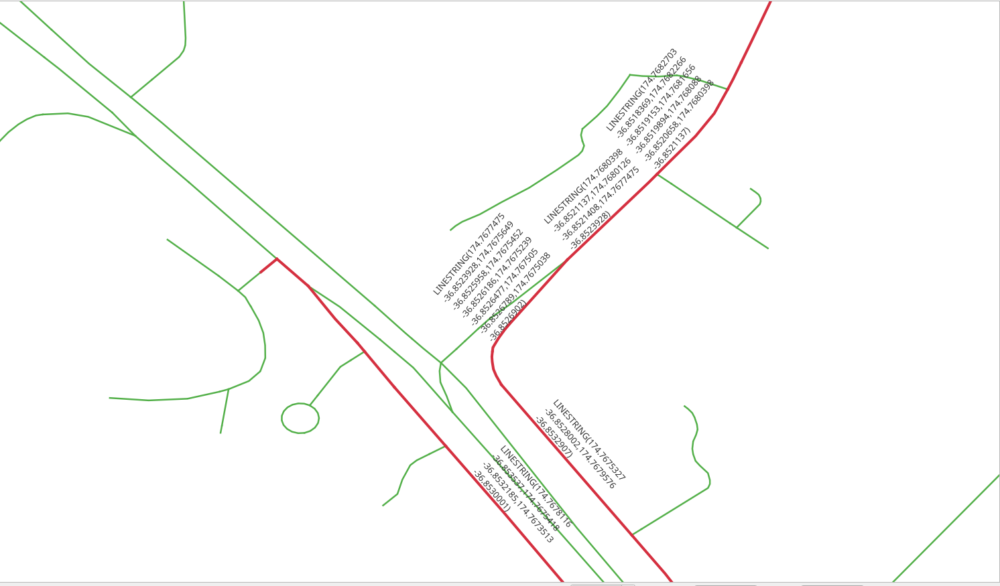

..
  ****************************************************************************
  pgRouting Workshop Manual
  Copyright(c) pgRouting Contributors

  This documentation is licensed under a Creative Commons Attribution-Share
  Alike 3.0 License: http://creativecommons.org/licenses/by-sa/3.0/
  ****************************************************************************

SQL function
###############################################################################

.. image:: images/sql_function/sql_route_names.png
  :scale: 25%
  :align: center

.. contents:: Chapter Contents

pgRouting functions provide `low level` interface.

When developing for a `higher level` application,
the requirements need to be represented in the SQL queries.
As these SQL queries get more complex, it is desirable to store them in postgreSQL
stored procedures or functions.
Stored procedures or functions are an effective way to wrap application logic, in this case,
related to routing logic and requirements.

The function requirements
===============================================================================

The function will wrap ``pgr_dijkstra``.

The function needs to work on any of the networks designed:

- ``vehicle_net``
- ``taxi_net``

The function needs to return the following routing information:

- ``seq`` - A unique identifier of the rows
- ``id`` - The segment's identifier
- ``name`` - The segment's name
- ``length`` - The segment's length
- ``seconds`` - Number of seconds to traverse the segment
- ``azimuth`` - The azimuth of the segment
- ``route_geom`` - The routing geometry
- ``route_readable`` - The geometry in human readable form.

.. rubric:: Design of the function

The function to be created ``wrk_dijkstra`` with the following input parameters and
output columns:

.. rubric:: Input parameters

================= ========= =================
Parameter          Type      Description
================= ========= =================
``edges_subset``  REGCLASS  The table/view that is going to be used for processing
``source``        BIGINT    The  identifier of the `departure` location.
``target``        BIGINT    The  identifier of the `destination` location.
================= ========= =================

.. rubric:: output columns

================== ========= =================
Name               Type      Description
================== ========= =================
``seq``             INTEGER   A unique number for each result row.
``id``              BIGINT    The edge identifier.
``name``            TEXT      The name of the segment.
``seconds``         FLOAT     The number of seconds it takes to traverse the segment.
``length``          FLOAT     The length in meters of the segment.
``azimuth``         FLOAT     The azimuth of the segment.
``route_readable``  TEXT      The geometry in human readable form.
``route_geom``      geometry  The geometry of the segment in the correct direction.
================== ========= =================

Additional information handling
===============================================================================

When the application needs additional information, like the name of the street,
``JOIN`` the results with other tables.

Exercise 1: Get additional information
-------------------------------------------------------------------------------

.. image:: images/sql_function/sql_route_names.png
  :width: 300pt
  :alt:  Route showing names

.. rubric:: Problem

* From |ch7_place_1| to |ch7_place_2|
* Get the following information:

  * ``seq``
  * ``id``
  * ``name``
  * ``seconds``
  * ``length``

.. rubric:: Solution

* The function returns the columns asked. (line **4**)
* Rename ``pgr_dijkstra`` results to application requirements names. (line
  **12**).
* ``LEFT JOIN`` the results with ``vehicle_net`` to get the additional
  information. (line **17**)

  * ``LEFT`` to include the row with ``id = -1`` because it does not exist on
    ``vehicle_net``

* Test from |ch7_id_1| to |ch7_id_2| on ``vehicle_net``. (Last line)

.. literalinclude:: ../scripts/basic/sql_function/sql_function.sql
   :language: sql
   :linenos:
   :force:
   :emphasize-lines: 4,12,17
   :start-after: get_more_info.txt
   :end-before: get_read_geom.txt

.. collapse:: Query results

  .. literalinclude:: ../scripts/basic/sql_function/get_more_info.txt

Geometry handling
===============================================================================

From pgRouting point of view, the geometry is part of the additional
information, needed on the results for an application. Therefore ``JOIN`` the
results with other tables that contain the geometry and for further processing
with PostGIS functions.

Exercise 2: Route geometry (human readable)
-------------------------------------------------------------------------------

.. rubric:: Problem

Route from the |ch7_place_1| to |ch7_place_2|

* Additionally to the previous exercise, get the

  * geometry ``geom`` in human readable form named as ``route_readable``

.. rubric:: Solution

* The function returns ``route_readable``. (line **6**)
* The routing query named ``results`` in a WITH clause. (line **11**)
* The ``geom`` processed with ``ST_AsText`` to get the human readable form.
  (line **19**).
* Test from |ch7_id_1| to |ch7_id_2| on ``vehicle_net``. (Last line)

.. literalinclude:: ../scripts/basic/sql_function/sql_function.sql
   :language: sql
   :linenos:
   :force:
   :emphasize-lines: 6,11,19
   :start-after: get_read_geom.txt
   :end-before: get_geom.txt

.. exercise 2 results

.. collapse:: Query results

  .. literalinclude:: ../scripts/basic/sql_function/get_read_geom.txt

Exercise 3: Route geometry (binary format)
-------------------------------------------------------------------------------

.. image:: images/sql_function/sql_route_geom.png
  :width: 300pt
  :alt: From |ch7_place_1| to |ch7_place_2|

.. rubric:: Problem

Route from the |ch7_place_1| to |ch7_place_2|

* Additionally to the previous exercise, get the

  * ``geom`` in binary format with the name ``route_geom``

.. rubric:: Solution

* The function returns ``route_geom``. (line **7**)
* The geometry ``geom`` of the segments (line **21**)
* Test from |ch7_id_1| to |ch7_id_2| on ``vehicle_net``. (Last line)

.. literalinclude:: ../scripts/basic/sql_function/sql_function.sql
   :language: sql
   :emphasize-lines: 7,21
   :force:
   :linenos:
   :start-after: get_geom.txt
   :end-before: wrong_directionality.txt

.. collapse:: Query results

  .. literalinclude:: ../scripts/basic/sql_function/get_geom.txt

Exercise 4: Route geometry directionality
-------------------------------------------------------------------------------

.. image:: images/sql_function/sql_route_geom_detail.png
  :width: 300pt
  :alt: From |ch7_place_1| to |ch7_place_2|

Visually, with the route displayed with arrows, it can be found that there are
arrows that do not match the directionality of the route.

To have correct directionality, the ending point of a geometry must match the
starting point of the next geometry

* Inspecting the detail of the results of `Exercise 2: Route geometry (human
  readable)`_

.. collapse:: Query: Rows where criteria is not met

  .. literalinclude:: ../scripts/basic/sql_function/sql_function.sql
    :language: sql
    :start-after: wrong_directionality.txt
    :end-before: fix_directionality.txt

.. literalinclude:: ../scripts/basic/sql_function/wrong_directionality.txt
  :language: sql

.. rubric:: Problem

Route from the |ch7_place_1| to |ch7_place_2|

* Fix the directionality of the geometries of the previous exercise

  * ``geom`` in human readable form named as ``route_readable``
  * ``geom`` in binary format with the name ``route_geom``
  * Both columns must have the geometry fixed for directionality.

.. rubric:: Solution

To get the correct direction some geometries need to be reversed:

* Reversing a geometry will depend on the ``node`` column of the query to
  Dijkstra.

* A conditional ``CASE`` statement that returns the geometry in human readable
  form:

  * Of the geometry when ``node`` is the ``source`` column.
  * Of the reversed geometry when ``node`` is not the ``source`` column.

* A conditional ``CASE`` statement that returns:

  * The geometry when ``node`` is the ``source`` column.
  * The reversed geometry when ``node`` is not the ``source`` column.

.. literalinclude:: ../scripts/basic/sql_function/sql_function.sql
   :language: sql
   :linenos:
   :force:
   :start-after: fix_directionality.txt
   :end-before: good_directionality.txt

.. collapse:: results

  .. literalinclude:: ../scripts/basic/sql_function/fix_directionality.txt

Inspecting the problematic rows, the directionality has been fixed.

.. collapse:: Query: Rows where criteria is not met

  .. literalinclude:: ../scripts/basic/sql_function/sql_function.sql
    :language: sql
    :start-after: good_directionality.txt
    :end-before: use_directionality.txt

.. literalinclude:: ../scripts/basic/sql_function/good_directionality.txt

Exercise 5: Using the geometry
-------------------------------------------------------------------------------

.. image:: images/sql_function/sql_azimuth_fixed.png
  :width: 300pt
  :alt: From |ch7_place_1| to the |ch7_place_2| show azimuth

There are many geometry functions in PostGIS, the workshop already covered some of them like
``ST_AsText``, ``ST_Reverse``, ``ST_EndPoint``, etc.
This exercise will make use an additional function ``ST_Azimuth``.

.. rubric:: Problem

Modify the query from the previous exercise

* Additionally obtain the azimuth in degrees of the corrected geometry.

.. rubric:: Solution

* The function returns ``aximuth``. (line **8**)
* The query from previous exercise is wrapped under additional subquery. (line
  **18**)
* The ``azimuth`` is processed in degrees. (line **35**).
* Test from |ch7_id_1| to |ch7_id_2| on ``vehicle_net``. (Last line)

.. literalinclude:: ../scripts/basic/sql_function/sql_function.sql
   :language: sql
   :force:
   :linenos:
   :emphasize-lines: 8,18,35
   :start-after: use_directionality.txt
   :end-before: using_fn1.txt

.. collapse:: results

  .. literalinclude:: ../scripts/basic/sql_function/use_directionality.txt

Exercise 6: Using the function
-------------------------------------------------------------------------------

Try the function with a combination of the interesting places:

* |id_1| |place_1|
* |id_2| |place_2|
* |id_3| |place_3|
* |id_4| |place_4|
* |id_5| |place_5|

Using different networks:

- ``vehicle_net``
- ``taxi_net``
- ``walk_net``

Names of the streets in the route

.. literalinclude:: ../scripts/basic/sql_function/sql_function.sql
  :language: sql
  :start-after: using_fn1.txt
  :end-before: using_fn2.txt

.. collapse:: Query results

  .. literalinclude:: ../scripts/basic/sql_function/using_fn1.txt

Total seconds spent in each street

.. literalinclude:: ../scripts/basic/sql_function/sql_function.sql
  :language: sql
  :start-after: using_fn2.txt
  :end-before: using_fn3.txt

.. collapse:: Query results

  .. literalinclude:: ../scripts/basic/sql_function/using_fn2.txt

Why it does not fully work with ``walk_net``?

.. literalinclude:: ../scripts/basic/sql_function/sql_function.sql
  :language: sql
  :start-after: using_fn3.txt

.. collapse:: Query results

  .. literalinclude:: ../scripts/basic/sql_function/using_fn3.txt
