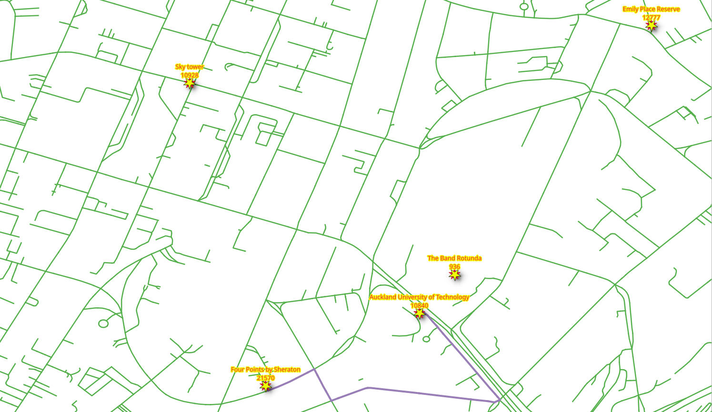
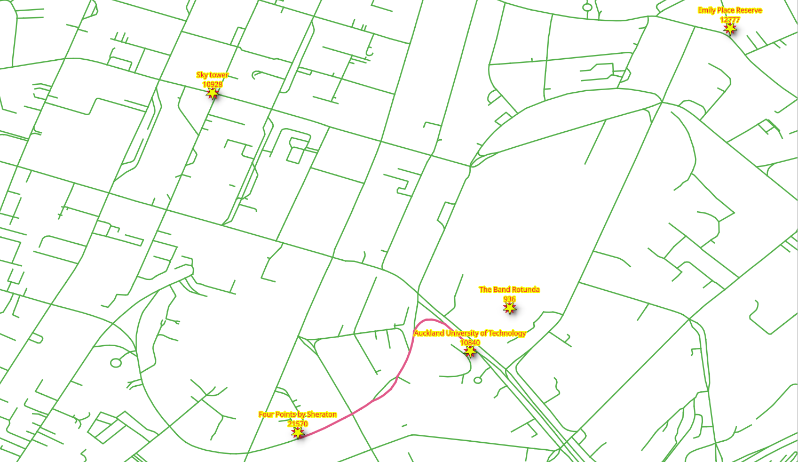

..
  ****************************************************************************
  pgRouting Workshop Manual
  Copyright(c) pgRouting Contributors

  This documentation is licensed under a Creative Commons Attribution-Share
  Alike 3.0 License: http://creativecommons.org/licenses/by-sa/3.0/
  ****************************************************************************

Vehicle Routing
===============================================================================

Routing, is not limited to pedestrians and most of the time is used for routing vehicles.

.. contents:: Chapter Contents

Routing for vehicles
-------------------------------------------------------------------------------

A query for vehicle routing generally differs from routing for pedestrians:

* The road segments are considered `directed`
* Costs can be:

  * Distance
  * Time
  * Euros
  * Pesos
  * Dollars
  * CO\ :sub:`2`\ emissions
  * Wear and tear on the vehicle, etc.

* The ``reverse_cost`` attribute must be taken into account on two way streets.

  * The costs should have the same units as the ``cost`` attribute
  * ``cost`` and ``reverse_cost`` values can be different

    * Due to the fact that there are roads that are **one way**

Depending on the geometry, the valid way:

* (``source, target``) segment ``IF cost >= 0 AND reverse_cost < 0``
* (``target, source``) segment ``IF cost < 0 AND reverse_cost >= 0``

A **wrong way** is indicated with a **negative value** and is not inserted in the
graph for processing.

**Two way** roads - ``IF cost >= 0 AND reverse_cost >= 0`` and their values can
be different. For example, it is faster going down hill on a sloped road.
In general, ``cost`` and ``reverse_cost`` do not need to be length; they can be
almost anything, for example - time, slope, surface, road type, etc., or they can
be a combination of multiple parameters.

.. rubric:: The following queries indicate the number of road segments, where a "one way" rule applies:

#. Number of (``source, target``) segments with ``cost < 0`` (line **3**).

   .. literalinclude:: ../scripts/basic/vehicles/vehicles.sql
       :start-after: oneway_cost.txt
       :end-before:  oneway_revc.txt
       :language: sql

   .. literalinclude:: ../scripts/basic/vehicles/oneway_cost.txt

#. Number of (``target, source``) segments with ``reverse_cost < 0`` (line **3**).

   .. literalinclude:: ../scripts/basic/vehicles/vehicles.sql
       :start-after: oneway_revc.txt
       :end-before:  route_going.txt
       :language: sql
       :emphasize-lines: 3

   .. literalinclude:: ../scripts/basic/vehicles/oneway_revc.txt

Exercise 1: Vehicle routing - going
...............................................................................

.. rubric:: Problem:

* From the "|place_1|" to the "|place_3|" by car.

.. rubric:: Solution:

* ``cost`` and ``reverse_cost`` columns, are in seconds.
* The vehicle is going from vertex |id_1| to |id_3|.

.. literalinclude:: ../scripts/basic/vehicles/vehicles.sql
  :start-after: route_going.txt
  :end-before: route_coming.txt
  :language: sql

.. collapse:: Query results

  .. literalinclude:: ../scripts/basic/vehicles/route_going.txt

Exercise 2: Vehicle routing - returning
...............................................................................

.. rubric:: Problem:

* From "|place_3|" to the "|place_1|" by car.

.. rubric:: Solution:

* The vehicle is going from vertex |id_3| to |id_1|.

.. literalinclude:: ../scripts/basic/vehicles/vehicles.sql
  :start-after: route_coming.txt
  :end-before: time_is_money.txt
  :language: sql

.. collapse:: Query results

  .. literalinclude:: ../scripts/basic/vehicles/route_coming.txt

.. note:: On a directed graph, going and coming back routes, most of the time are different.

Exercise 3: Vehicle routing when time is money
...............................................................................

.. rubric:: Problem:

* From "|place_3|" to the "|place_1|" by taxi.

.. image:: images/vehicle/vehicle_time_is_money.png
  :width: 300pt
  :alt: From |place_3| to |place_1| by taxi.

.. rubric:: Solution:

* Use the ``taxi_net``.
* The cost is ``$100 per hour``.

  * Using ``cost`` and ``reverse_cost`` columns, which are in seconds.

    * The duration in hours is ``cost / 3600``.
    * The cost in ``dollars`` is ``cost / 3600 * 100``.

* The vehicle is going from vertex |id_3| to |id_1|.

.. literalinclude:: ../scripts/basic/vehicles/vehicles.sql
  :start-after: time_is_money.txt
  :end-before: add_penalty.txt
  :language: sql

.. collapse:: Query results

  .. literalinclude:: ../scripts/basic/vehicles/time_is_money.txt

.. note::
  Comparing with `Exercise 2: Vehicle routing - returning`_:

  * The total number of records are identical.
  * The node sequence is identical.
  * The edge sequence is identical.
  * The cost and agg_cost results are directly proportional.

Cost manipulations
-------------------------------------------------------------------------------

In this workshop, costs are going to be manipulated using the ``configuration`` table.

Exercise 4: Vehicle routing without penalization
...............................................................................

.. rubric:: Problem:

* From the "|place_3|" to "|place_1|"

.. rubric:: Solution:

* Add a penalty column

  * All roads have a ``penalty`` of ``1``.

  .. literalinclude:: ../scripts/basic/vehicles/vehicles.sql
     :start-after: add_penalty.txt
     :end-before: use_penalty.txt

* The vehicle's cost in this case will be in penalized seconds.

  * Costs are to be multiplied by :code:`penalty` (lines **5** and **6**).
  * Costs won't change (:math:`cost * 1 = cost`).

* The :code:`configuration` table is linked with the :code:`ways` table by the
  :code:`tag_id` field using a ``JOIN``
* The vehicle is going from vertex |id_3| to vertex |id_1|.

.. literalinclude:: ../scripts/basic/vehicles/vehicles.sql
   :start-after: use_penalty.txt
   :end-before: update_penalty.txt
   :language: sql
   :linenos:
   :force:

.. collapse:: Query results

  .. literalinclude:: ../scripts/basic/vehicles/use_penalty.txt

Exercise 5: Vehicle routing with penalization
...............................................................................

.. rubric:: Concept:

Change the cost values for the :code:`configuration` table, in such a way, that the

* Bicycle roads roads are not used.

  * ``penalty < 0`` makes the road not to be included in the graph.

* Using residential roads is not encouraged.

  * ``penalty > 1`` makes the road slower for the calculations.

* Using "faster" roads is highly encouraged.

  * ``penalty < 1`` makes the road faster for the calculations.

* All other roads are not penalized.

  * ``penalty = 1`` does not modify the road times.

The ``penalty`` values can be changed with ``UPDATE`` queries.

.. note:: These values are an exaggeration.

.. literalinclude:: ../scripts/basic/vehicles/vehicles.sql
   :start-after: update_penalty.txt
   :end-before: get_penalized_route.txt
   :language: sql
   :force:

.. rubric:: Problem:

* From the "|place_3|" to "|place_1|" with penalization.

.. image:: images/vehicle/vehicle_use_penalty.png
  :scale: 25%
  :alt: From |place_3| to |place_1|

.. rubric:: Solution:

* Using the same query from `Exercise 4: Vehicle routing without penalization`_

.. literalinclude:: ../scripts/basic/vehicles/vehicles.sql
   :start-after: get_penalized_route.txt
   :end-before: time_in_secs.txt
   :linenos:
   :language: sql

.. collapse:: Query results

  .. literalinclude:: ../scripts/basic/vehicles/get_penalized_route.txt

.. note::
  Comparing with `Exercise 3: Vehicle routing when time is money`_:

  * The total number of records changed.

    * The node sequence changed.
    * The edge sequence changed.

  * The costs do not change proportionally.

Exercise 6: Time in seconds of penalized route using a view
...............................................................................

.. rubric:: Problem:

Get the times in seconds of a penalized route

.. rubric:: Solution:

* Create a penalized view by joining the ``vehicle_net`` joined with the
  ``configuration`` table

  * Use the inner query from `Exercise 5: Vehicle routing with penalization`_

    .. literalinclude:: ../scripts/basic/vehicles/vehicles.sql
       :start-after: penalized_view.txt
       :end-before: using_view.txt
       :language: sql
       :force:

* Get the route
  ``configuration`` table

.. literalinclude:: ../scripts/basic/vehicles/vehicles.sql
   :start-after: using_view.txt
   :end-before: vehicles_end.txt
   :language: sql
   :force:

.. collapse:: Query results

  .. literalinclude:: ../scripts/basic/vehicles/using_view.txt
