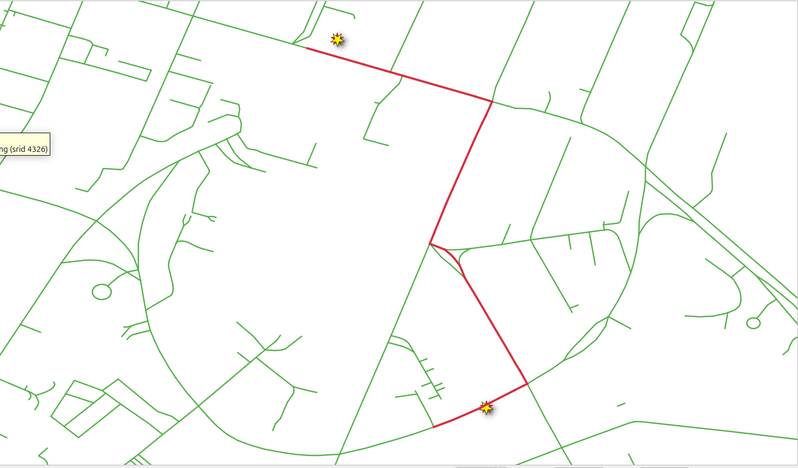
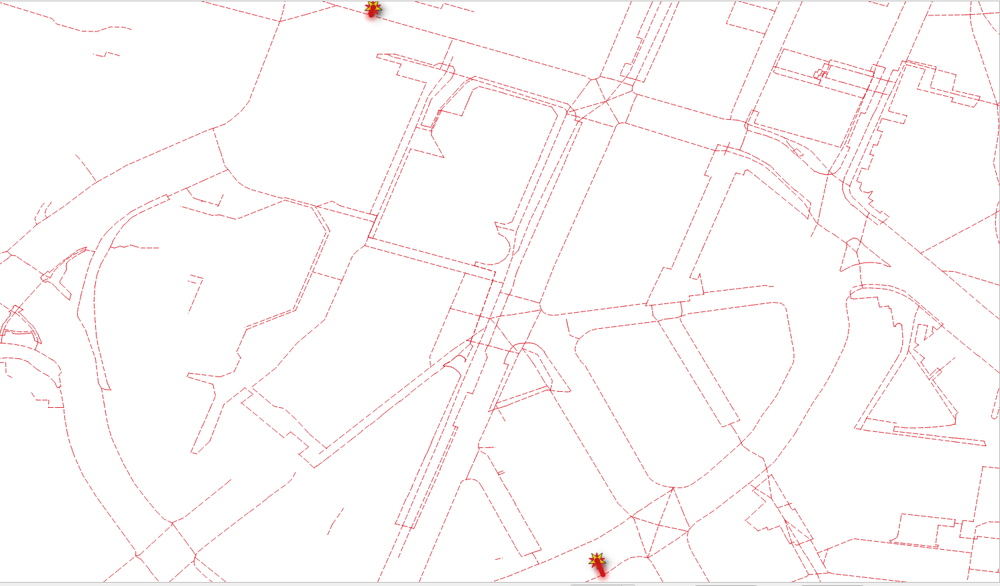

..
  ****************************************************************************
  pgRouting Workshop Manual
  Copyright(c) pgRouting Contributors

  This documentation is licensed under a Creative Commons Attribution-Share
  Alike 3.0 License: http://creativecommons.org/licenses/by-sa/3.0/
  ****************************************************************************

Routing using points
###############################################################################

Other kind of functions are `pl/pgsql
<https://www.postgresql.org/docs/current/plpgsql.html>`__. As the applications
requirements become more complex, building queries and storing queries in a
variable becomes necessary

pgRouting functions in this chapter

- `pgr_findCloseEdges`_
- `pgr_withPoints`_

.. contents:: Chapter contents

Requirements for routing lat,lon points
===============================================================================

.. rubric:: Chapter problem:

* Create a function ``wrk_withPoints`` that allows routing from two point
  geometries and works for

  * ``vehicle_net``
  * ``taxi_net``
  * ``walk_net``

* The function takes as input parameters:

  - The edges table name
  - Latitude/longitude of two point

* Returns

  - the same information as in :doc:`sql_function` chapter problem.
  - or the query that it builds

The detailed description:

.. rubric:: Input parameters

================  ==========  ================================================
Parameter         type        Description
================  ==========  ================================================
``edges_subset``  REGCLASS    Edge table name identifier.
``lat1``          NUMERIC     The latitude of the `departure` point.
``lon1``          NUMERIC     The longitude of the `departure` point.
``lat2``          NUMERIC     The latitude of the `destination` point.
``lon2``          NUMERIC     The longitude of the `destination` point.
``do_debug``      BOOLEAN     Flag to create a ``NOTICE`` with the query that
                              is been executed
================  ==========  ================================================

.. rubric::  Output columns

================== ========= =================
Name               Type      Description
================== ========= =================
``seq``             INTEGER   A unique number for each result row.
``id``              BIGINT    The edge identifier.
``name``            TEXT      The name of the segment.
``seconds``         FLOAT     The number of seconds it takes to traverse the segment.
``length``          FLOAT     The leng in meters of the segment.
``azimuth``         FLOAT     The azimuth of the segment.
``route_readable``  TEXT      The geometry in human readable form.
``route_geom``      geometry  The geometry of the segment in the correct direction.
================== ========= =================

For this chapter, the following points will be used for testing.

* (lat,lon) = (@POINT1_LAT@, @POINT1_LON@)
* (lat,lon) = (@POINT2_LAT@, @POINT2_LON@)

pgr_findCloseEdges
-------------------------------------------------------------------------------

Finds the close edges to a point geometry.

.. rubric:: Signature Summary

.. code-block:: sql

   pgr_findCloseEdges(Edges SQL, point, tolerance, [options])
   pgr_findCloseEdges(Edges SQL, points, tolerance, [options])

   Options: [cap, dryrun]

   Returns set of (edge_id, fraction, side, distance, geom, edge)
   OR EMPTY SET

Exercise 1: Get the nearest edge
...............................................................................

.. rubric:: Problem

Get the nearest edge on the graph of the following points.

* (pid, lat, lon) = (1, @POINT1_LAT@, @POINT1_LON@)
* (pid, lat, lon) = (2, @POINT2_LAT@, @POINT2_LON@)

.. rubric:: Solution

* Build the geometry of the points with the appropiate SRID. (lines **4** and
  **10**)
* Get the union of the individual queries

.. literalinclude:: ../scripts/basic/withPoints/withPoints.sql
   :language: sql
   :linenos:
   :start-after: closestedges.txt
   :end-before: route_withPoints.txt

.. collapse:: Query results

  .. literalinclude:: ../scripts/basic/withPoints/closestedges.txt

pgr_withPoints
-------------------------------------------------------------------------------

Returns the shortest path in a graph with additional temporary vertices.

.. rubric:: Signature Summary

.. code-block:: sql

   pgr_withPoints(Edges SQL, Points SQL, start vid, end vid, [driving side] [options])
   pgr_withPoints(Edges SQL, Points SQL, start vid, end vids, [driving side] [options])
   pgr_withPoints(Edges SQL, Points SQL, start vids, end vid, [driving side] [options])
   pgr_withPoints(Edges SQL, Points SQL, start vids, end vids, [driving side] [options])
   pgr_withPoints(Edges SQL, Points SQL, Combinations SQL, [driving side] [options])

   options: [directed, details])

   Returns set of (seq, path_seq, start_vid, end_vid, node, edge, cost, agg_cost)
   OR EMPTY SET

Exercise 2: Point routing
...............................................................................

.. rubric:: Problem

Route from point **1** to  point **2** on the ``vehicle_net`` where:

* point **1**: (lat, lon) = (1, @POINT1_LAT@, @POINT1_LON@)
* point **2**: (lat, lon) = (2, @POINT2_LAT@, @POINT2_LON@)

.. rubric:: Solution

* The query from `Exercise 1: Get the nearest edge`_ is used as the inner qyery
  for points.
* Using negative values to avoid conficts with vertices with the same value:

  * Routing from point **-1** to point **-2**

.. literalinclude:: ../scripts/basic/withPoints/withPoints.sql
   :language: sql
   :force:
   :start-after: route_withPoints.txt
   :end-before: wrk_withPoints.txt

.. collapse:: Query results

  .. literalinclude:: ../scripts/basic/withPoints/route_withPoints.txt

Exercise 3: Creating the point routing function
...............................................................................

.. rubric:: Problem

Create the function ``wrk_withPoints`` to route from locations using latitude
and longitude values.

* Analize the function.

.. rubric:: Solution

Creating a ``plpgsql`` function.

.. literalinclude:: ../scripts/basic/withPoints/withPoints.sql
   :language: sql
   :force:
   :start-after: wrk_withPoints.txt
   :end-before: use_fn_1.txt

.. rubric:: Analysis

The function's signature:

* The input parameters instead of vertex identifiers, now it has the latitude
  and longitude of a couple of points.
* The function returns the same set of values calculated on the
  :doc:`sql_function`.

.. literalinclude:: ../scripts/basic/withPoints/withPoints.sql
   :language: sql
   :linenos:
   :start-after: wrk_withPoints.txt
   :end-before: signature ends

Getting the closest query:

* The query looks like the one on `Exercise 1: Get the nearest edge`_
* Using PostgreSQL ``format`` to make substitutions.

  * The first parameter is the string to be replaced
  * The rest are the data parameters, are the strings use for replacement.
  * ``lat1``, ``lon1`` values will replace ``%2$s, %3$s`` respectively.
  * ``lat2``, ``lon2`` values will replace ``%4$s, %5$s`` respectively.

.. literalinclude:: ../scripts/basic/withPoints/withPoints.sql
   :language: sql
   :force:
   :linenos:
   :start-after: -- 0
   :end-before: -- 1

Getting the routing results:

* The query looks like the one on `Exercise 2: Point routing`
* Using PostgreSQL ``format`` to make substitutions.

  * The ``edges_subset`` value will replace ``%1$I``.
  * The ``closest_query`` value will replace ``%2$s``.

.. literalinclude:: ../scripts/basic/withPoints/withPoints.sql
   :language: sql
   :force:
   :linenos:
   :start-after: -- 1
   :end-before: -- 2

Getting the additional information:

* The subquery looks like the one in the function created on
  :doc:`sql_function`.
* A joined table can not be a variable

  * Using PostgreSQL ``format`` to make substitutions.
  * To make it work on the ``walk_net``, the whole query needs to be in
    ``TEXT``.
  * The ``edges_subset`` value will replace ``%1$I``:

.. literalinclude:: ../scripts/basic/withPoints/withPoints.sql
   :language: sql
   :force:
   :linenos:
   :start-after: -- 2
   :end-before: -- 3

Building the complete query:

* The complete query looks like the one in the function created on
  :doc:`sql_function`.
* Concatenation of strings is used.

.. literalinclude:: ../scripts/basic/withPoints/withPoints.sql
   :language: sql
   :force:
   :linenos:
   :start-after: -- 3
   :end-before: -- 4

Exercise 4: Using wrk_withPoints
...............................................................................

.. rubric:: Problem

Use ``wrk_withPoints``

* Departure point is: (lat,lon) = ``(@POINT1_LAT@, @POINT1_LON@)``
* Destination point is: (lat,lon) = ``(@POINT2_LAT@, @POINT2_LON@)``
* For ``vehicle_net``:

  * Get the names of the streets of the route.

* For ``taxi_net``:

  * Get the query that is been generated.

* For ``walk_net``:

  * Use with default value of ``do_debug``.
  * Store results on a table.
  * Show the table contents.

.. rubric:: Solution

For ``vehicle_net``:

* The first parameter is the table name.
* The next two parameters are the latitude and longitude of the departure point.
* The next two parameters are the latitude and longitude of the destination point.
* Use with default value of ``do_debug``.

.. literalinclude:: ../scripts/basic/withPoints/withPoints.sql
  :language: sql
  :start-after: use_fn_1.txt
  :end-before: use_fn_2.txt

.. collapse:: Query results

  .. literalinclude:: ../scripts/basic/withPoints/use_fn_1.txt

For ``taxi_net``:

* Do a dry run by adding ``true`` to get the query that is executed.

.. literalinclude:: ../scripts/basic/withPoints/withPoints.sql
  :language: sql
  :start-after: use_fn_2.txt
  :end-before: use_fn_3.txt

.. collapse:: Query results

  .. literalinclude:: ../scripts/basic/withPoints/warnings.txt

For ``walk_net``:

.. literalinclude:: ../scripts/basic/withPoints/withPoints.sql
  :language: sql
  :start-after: use_fn_3.txt
  :end-before: \o

.. collapse:: Query results

  .. literalinclude:: ../scripts/basic/withPoints/use_fn_3.txt
